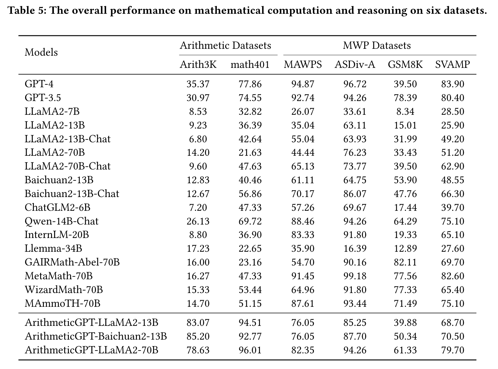
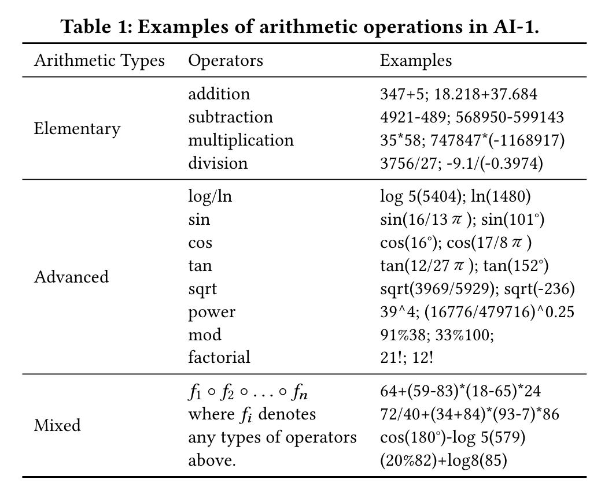
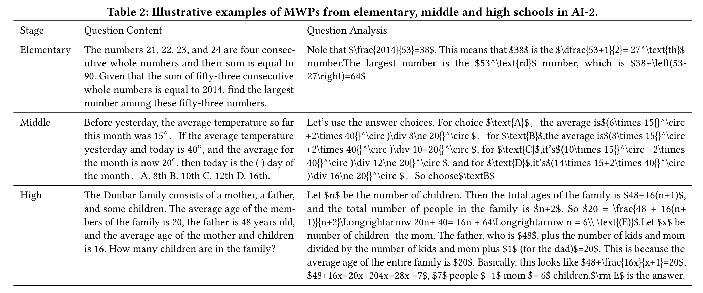
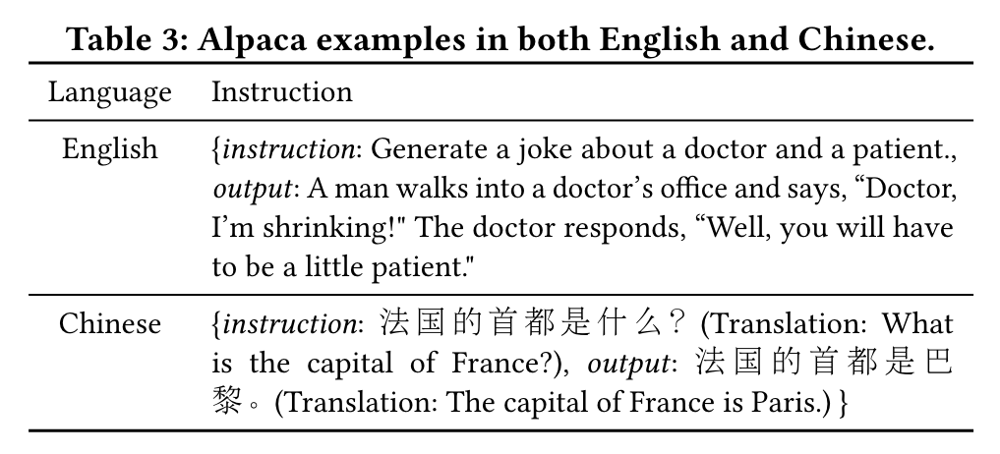
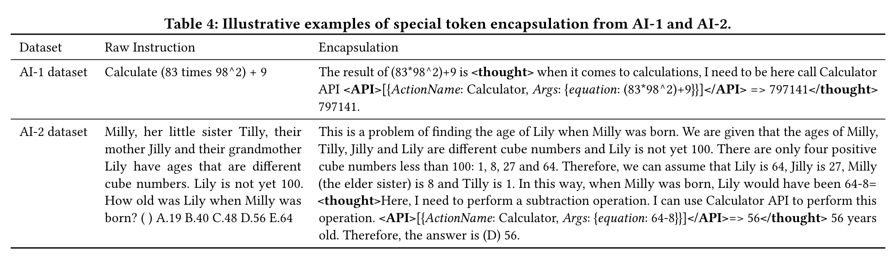
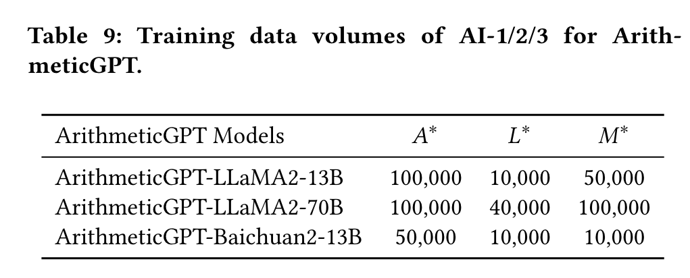
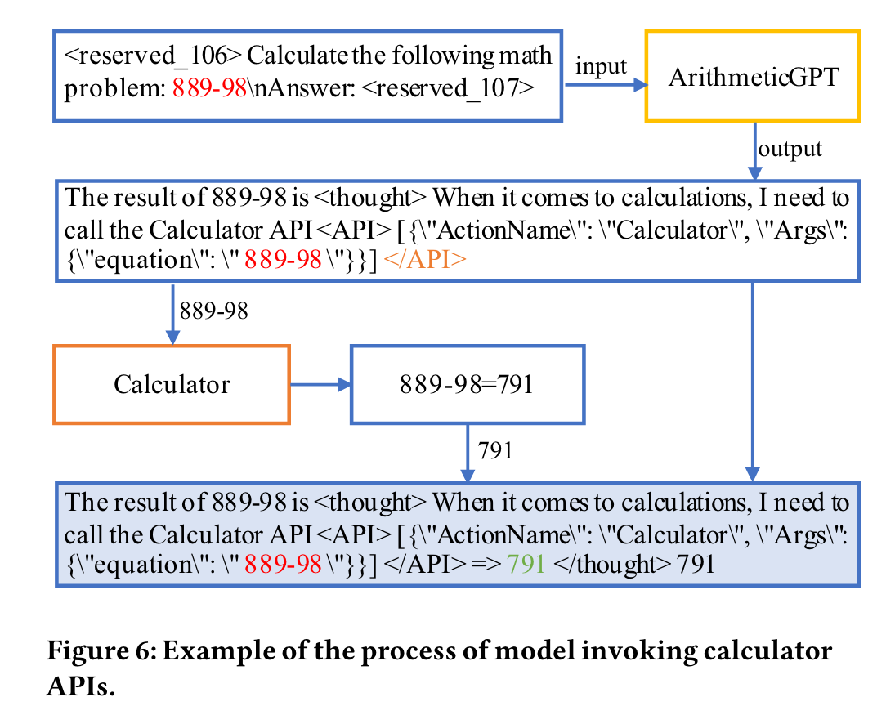

# ArithmeticGPT

## Introduction
**ArithmecticGPT** is a practical framework designed to enhance the advanced arithmetic capabilities of small-sized Language Learning Models (LLMs) while preserving their original natural language abilities. This is achieved by fine-tuning the base models using a specially curated arithmetic instruction dataset, ArithInstruct, which includes calculator API tokens. These tokens allow the LLMs to autonomously perform precise computations without explicit instructions, thereby seamlessly executing complex arithmetic calculations within natural language sentences. We compare our approach with 17 state-of-the-art LLMs and demonstrate its effectiveness.



## Running the Code

### Fine tuning
    # LLaMA2-13B-Chat
    bash /sft/train_scripts/shell/llama2_13b_chat_tool.sh
    
    # LLaMA2-70B-Chat
    bash /sft/train_scripts/shell/llama2_70b_chat_tool.sh
    
    # Baichuan2-13B-Chat
    bash /sft/train_scripts/shell/baichuan2_13b_chat_tool.sh
### Inference and Evaluation
We use the opencompass inference and evaluation framework
```
#inference and evaluation
python run.py configs/eval_models_tool.py -m=all -w outputs/llama 

# if in slurm
python run.py configs/eval_models_tool.py -m=all -w outputs/output_file_name --slurm -p default_queue

# only evaluation
python run.py configs/eval_models_tool.py -m=eval -r eval_file_name -w outputs/output_file_name
```
## Datasets
### Training Datasets
We carefully design an arithmetic instruction dataset \textsc{ArithInstruct} that contains AI-1, AI-2 and AI-3.

#### AI-1: Arithmetic Expression Datase
150,000 different forms of calculation expressions of 12 types of arithmetic operations on low-digits, high-digits, decimal numbers and Chinese alias of numbers. The AI-1 data helps the small-size LLMs recognize various forms of mathematical expressions.



#### AI-2: Math Word Problem Datasets
100,000 math word problems (MWPs) with detailed problem analysis. Every arithmetic expression in the problem analysis is carefully annotated. The AI-2 data improves the small-size LLMs' understanding of when and how these arithmetic expressions are used.



#### AI-3: Human Conversational Dataset
AI-3: 50,000 human-like Chinese and English conversation data extracted from the Stanford Alpaca dataset. The AI-3 data keeps LLMs' original abilities such as conversation and reading comprehension.



### Testing Datasets
#### Arithmetic test sets
- **Arith3k**  
This is an Arithmetic evaluation dataset we constructed, called Arith3k. It includes 14 types of mathematical operations, encompassing simple arithmetic operations, more difficult logarithms, factorials, trigonometric function operations, as well as complex compound function operations. It can comprehensively evaluate the computational ability of LLMs.
- **math401**  
math401 is an Arithmetic dataset comprising 401 problems, which are systematically orgainzed into 1 Euler equation and 16 distinct groups of 25 problems each.

#### MWP test sets
- **GSM8K**  
GSM8K is a collection of high-quality grade school math problem. It comprises 7,473 training samples and 1,319 testing samples.
- **SVAMP**  
SVAMP consists of 1000 mathematical word problems, each containing a maximum of two mathematical expressions and one unknown variable. These problems are created by making simple modifications to word problems from existing datasets such as ASDiv-A.
- **MAWPS**  
MAWPS comprises 3,320 Englist mathematical word problems, encompassing basic arithmetic operations. These problems are collected from various online educational platforms, with a total of 238 test samples included.
- **ASDiv-A**  
ASDiv-A encompasses 1,218 mathematical problems that involve arithmetic operations, categorized into six levels of difficulty(1-6). It includes 122 test samples.

#### NLP test sets
- **PIQA**  
PIQA is a task that involves choosing the most logical solution from two given options based on a specific scenario. The purpose of this task is to evaluate a  model's knowledge of physical common sense. The dataset for this task includes 16,000 training samples, 800 development samples, and 2,000 test samples, all of which are in Englist.
- **HellaSwag**  
HellaSwag is a dataset that comprises 70,000 multiple-choice questions. Each question presents a scenario and four potential outcomes, with the task being to select the most plausible ending. The questions are derived from two domains: ActivityNet and WikiHow, involving scenarios from video and text respectively.
- **BoolQ**  
BoolQ is a datasets specifically designed for answering yes/no questions, consisting of 15,942 instances. Every instance is composed of three elements: a question, a passage, and an answer.
- **RACE** 
RACE is an extensive reading comprehension dataset, encompassing over 28,000 passages and close to 100,000 questions. The dataset is collected from English exams of middle and high schools in China.

## Special Tokens and Calculation APIs
To allow the small-size LLMs to autonomously invoke precise computations without explicit instructions and is able to execute any complex arithmetic calculations seamlessly inside natural language sentences, we employ special tokens ''<thought>'' and ''<API>'' to encapsulate arithmetic expressions in the AI-1 and AI-2 datasets, which leads to precise identification and interpretation of mathematical expressions within natural language.  In addition, we process the AI-3 to ensure its consistency with the structure of our AI-1 and AI-2. The processing of these datasets is designed to preserve the inherent capabilities of the small-size LLMs, while simultaneously augmenting their proficiency in handling complex arithmetic and large numbers. 



## The ArithmeticGPT Framework

### Supervised Fine-tuning
We propose a three-stage supervised fine-tuning strategy to not only enable the arithmetic ability in small-size LLMs but keep their original abilities of natural language understand- ing.
The data ratio used for three stage of model fine-tuning：

Specifically, we first fine-tune the small- sized LLMs with different amounts of data in AI-1. We only keep the model that achieves the highest accuracy in arithmetic validation set and the corresponding arithmetic training volume denoted as $A^\*$. Then, in the second round of fine-tuning, we maintain the size of the arithmetic training data to $A^\*$ and add different volumes of human-like conversational training data from AI-3. We evaluate the different intermediate tuned LLMs via a joint validation set of arithmetic, MWP and NLP tasks. Since training data of natural language can enhance the LLM’s understanding of MWPs, we select the model with the highest average score from the joint validation dataset with the corresponding volume of training data of natural language denoted as $L^\*$. In the third stage of fine-tuning, we fix the sizes of the arithmetic and natural language training data to $A^\*$ and $L^\*$, and vary different volumes of MWP training data. Finally, we select the fine-tuned model with the highest average score across the joint evaluation datasets and the corresponding volume of training data of MWP denoted as $M^\*$ .



### Inference
When conducting LLM inference, the fine-tuned small-size LLMs will automatically generate the learned special tokens to invoke the calculating APIs for mathematical calculation. Specifically, upon the identification of the special tokens <API> and </API> simultaneously, the calculator is automatically triggered to execute the calculation. The result of the calculator’s computation is then relayed back to the model to yield a complete output result. The integration of the calculator invocation within the model ensures a smooth transition between comprehending the problem and executing the necessary calculations. 


